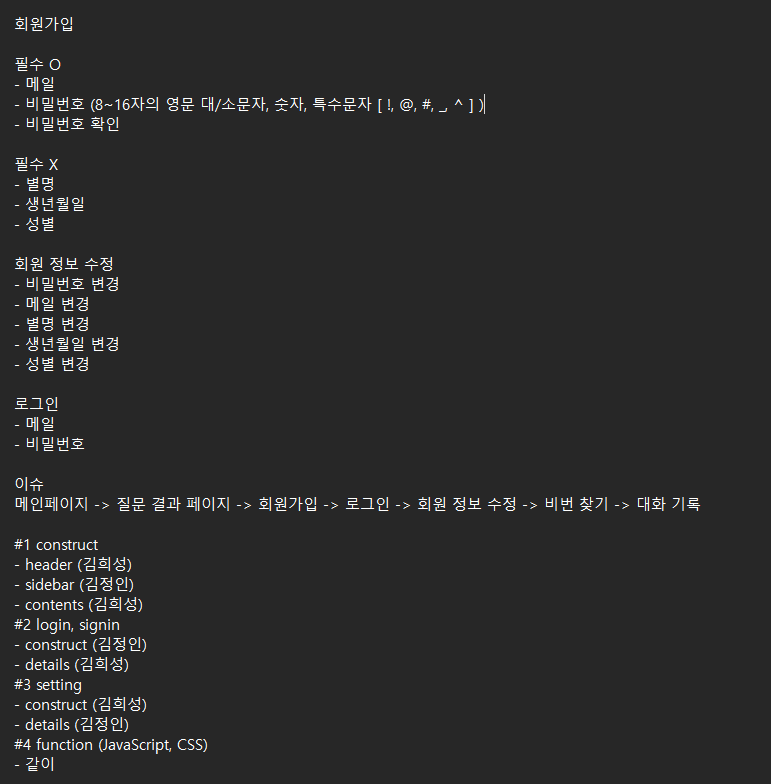
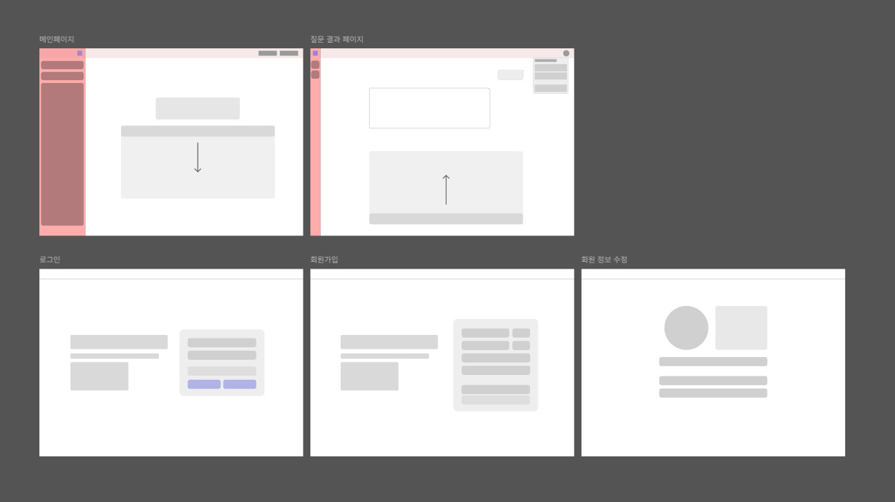

# 1차 프로젝트 1팀 회의록

- 날짜: 2025년 12월 15일
- 참여자: 김희성 (팀장), 김정인

## 오전 회의 내용

- (김희성) 전체적인 화면의 기본적인 구성 및 밴치마킹할 사이트 등을 제공
- (김희성) Figma를 통한 구성 작성
- (김정인) 전체적인 구도를 작성하면서, 메인페이지의 검색창 위치를 상단에 위치하여 검색할 시, 아랫쪽에 스크롤 되어 공간활용을 하자.
- (김정인) 질문 결과 페이지에서 오른쪽 상단 버튼을 눌렀을 시, 계정 이름이나 로그아웃 버튼이 나올 수 있도록 만드는게 좋을 것 같다.

## 작업 목표

- Figma를 이용해 화면 설계서를 작성
- 작업 분배

## 작업 과정

- Figma를 이용해 페이지들의 기본적인 구조들을 설계
- 해당 페이지들의 구조들, 어떤 방식으로 사용자에게 보여질지에 대해서 팀원과 함께 상의
- 해당 상의는 대략적으로 끝났고, 추가적인 부분들은 직접 만들어보면서 구체적으로 디테일들을 추가할 예정
- 분배 내용
### 작업 순서
- 메인페이지 -> 질문 결과 페이지 -> 회원가입 -> 로그인 -> 회원 정보 수정 -> 비밀번호 찾기 -> 대화 기록

### #1 메인페이지 구조
- header (김희성)
- sidebar (김정인)
- contents (김희성)
### #2 로그인, 회원가입
- construct (김정인)
- details (김희성)
### #3 개인 정보 수정
- construct (김희성)
- details (김정인)
### #4 기능 (JavaScript, CSS)
- 공동 작업

### 메모

### 전체적인 페이지의 와이어 프레임 작성

[`Figma로 이동`](https://www.figma.com/design/iiIL3nvEozaVNWEUbw6U0R/AI?node-id=0-1&t=tLfRRqP0CBi5oeWU-1)

## 작업 회고

- (김희성) 딱히 어려울 건 없어보여서 다행이었고, 해당 페이지들을 모두 구성한 뒤, 디테일들을 조금씩 챙겨나가며 완성도 높은 결과물을 만들어 내고싶다는 생각이 들었다.
- (김희성) 디자인 구상은 언제나 머리아픈 일인 것 같다.
- (김정인) fork 구성 형태가 숙지되지 않아 팀장님으로부터 설명을 통해 이해하였습니다.
- (김정인) ai 페이지들마다 조금씩 구성 방식에 차이가 있어 어느 부분이 사용자에게 더 친화적인 형태로 느껴질지에 대한 고민의 시간들을 가지게 되었습니다.

## 내일 목표

- 화면 설계서 다듬기
- 첫 작업들 시작하기